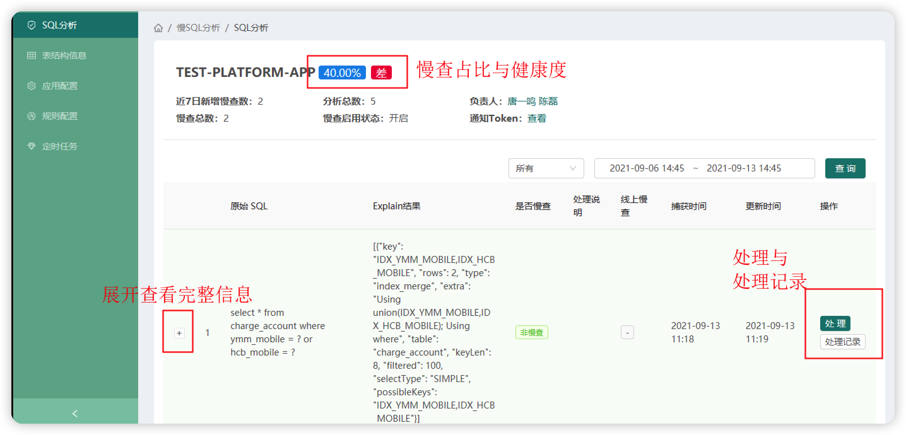

# 慢SQL检测

这个平台我是阅读参考了Tester Home上文章 [使用插桩技术解决慢查询测试问题](https://testerhome.com/topics/29228) 后实现的，之前在公司内部使用，现在改造开源了出来。由于时间仓促，改造中如果导致了Bug，希望各位提Issue告诉我，或者你帮助我修改也可以。

## 代码介绍
项目主要分四个部分：
- sql-capture-plugin

    一个sql语句的捕获插件，基于 [Gravity](https://github.com/ymm-tech/gravity) 的Java Agent开发，这是运满满开源的一款简洁优秀的字节码增强的AOP框架，得益于Gravity的开源，本项目才能够脱离我前公司环境构建并开源。

- sql-spring-plugin 
    
    一个Spring插件，用于应用加载capture插件后，可以先去调用服务端接口获取一下捕获规则

- sql-detect-server

    我们的平台服务端

- sql-detect-h5

    我们的平台前端

- sql-service-demo
    
    一个演示应用，可以用它来调试代码，查看捕获效果

## 准备工作
1. 根据DDL文件里的语句，建数据库和数据表
2. 导入sample data文件夹中的数据到响应库表中
3. clone [Gravity](https://github.com/ymm-tech/gravity) 项目,并本地编译打包好agent包
4. Maven 打包好我们的插件 sql-capture-plugin 和 sql-spring-plugin
5. 启动平台前后端
6. 启动演示demo应用，启动前修改启动配置：-javaagent:/YOUR-PATH/gravity-agent.jar=appName=sql-service-demo,localDebug=true
7. 第一次启动后，用户根目录会创建好.gravity的目录，将我们的插件拷贝到.gravity/sql-service-demo/agent/下，重新启动应用，其他应用同理拷贝到对应目录下。

这样，你就可以把玩应用，发起sql调用，观察捕获和数据分析了。

## 重要
这个平台的核心在于规则，使用什么样的规则来认定是慢查询，又需要忽略哪些语句，这需要大量的语句分析后经验的积累与优化了，我内置的规则只是最粗暴的一种，你需要自己结合实践去精细化他们。

## 优化，留给你自己来做了
- 数据上报使用消息中间件
- 定时任务管理使用XXL-JOB
- 智能化与问题相似度分析
- sql快慢等级

## 截图（部分功能未在截图内体现）

